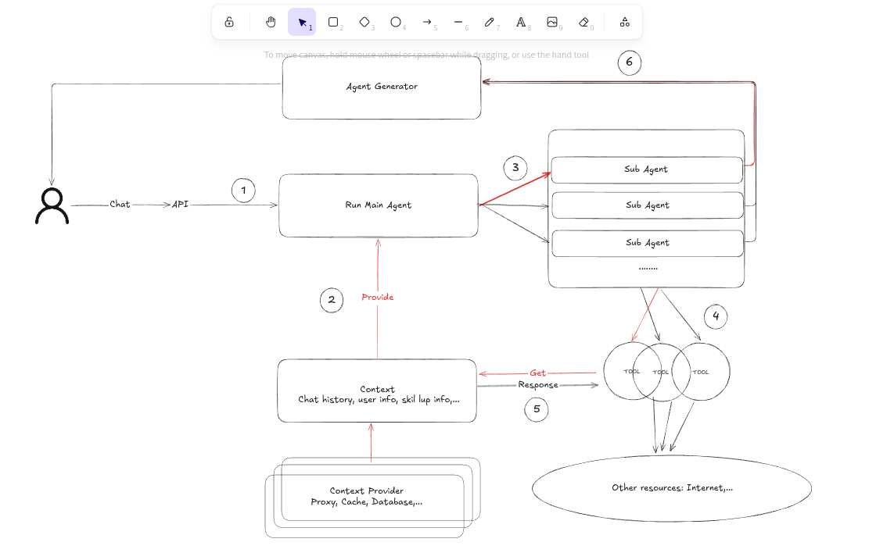

# Agent architecture

##  supervisor:
- Supervisor: Quan ly cac agent, phan cong nhiem vu, quan ly luong thuc thi, giup viec giao tiep giua cac agent.
- Swarm: Mot con agent co the tuong tac voi cac agent khac va nguoc lai
## 
# 
- [x] Lay thong tin noi bo
- [x] Lay thong tin lich su chat cua rieng nguoi dung
- [x] Agent dieu phoi
- [x] Agent tong hop

# Resources:
- https://medium.com/@shamim_ru/openai-agents-sdk-with-local-llm-461c77a5e7fb
### Core Components:
- Agent Loop: Lap lai qua trinh goi tools va xu ly ket qua. (lap vai lan xu ly - nhu copilot la 15 - 22 lan)
- Handoff System: Phan cong nhiem vu tu dong giua cac agent.
- Guardrails: Thuc hien cac pipeline xac thuc song song cho viec lam sach du lieu nhap va kiem tra an toan du lieu xuat. 
- Tracing: Quan sat tu xay dung voi truc tuyen luong thuc thi va giam sat hieu suat.

# OpenAI Swarm
- https://www.akira.ai/blog/multi-agent-orchestration-with-openai-swarm?utm_source=chatgpt.com  
- https://github.com/openai/swarm  

# Summary:
- Openai:
  + Danh gia tinh nang:
    1. 1 Con agent co the lam duoc gi:
      + Tools:Tool co san, tools tu che
      + Subagent (HandOffs)
      + MCP connnect
      + Guardrail: Quy dinh duoc input output
    2. N Con agent co the lam duoc gi:

  + Trien khai:
    + 1 Servcce handle moi thu trong workflow
    2. N Con agent co the lam duoc gi:

  + Use case:
     
- LangGraph:
  + Danh gia tinh nang:
    1. 1 Con agent co the lam duoc gi:
    2. N Con agent co the lam duoc gi:

  + Trien khai:
  + Use case:
  
- CrawAI:
  + Danh gia tinh nang:
    1. 1 Con agent co the lam duoc gi:
    2. N Con agent co the lam duoc gi:

  + Trien khai:
  + Use case:

# Questions:
1. How to scale out for multiple services?

# NOTe:
OPENAI:
https://openai.github.io/openai-agents-python/models/